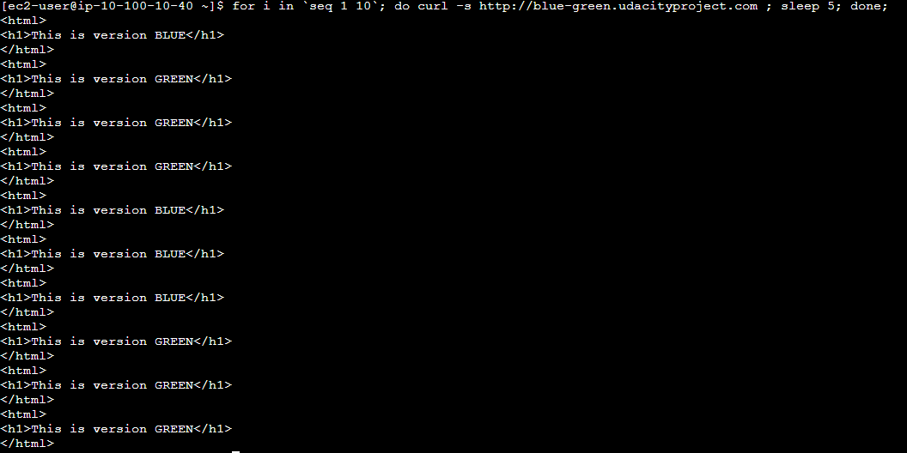
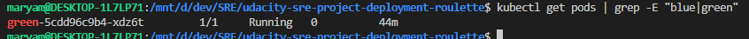
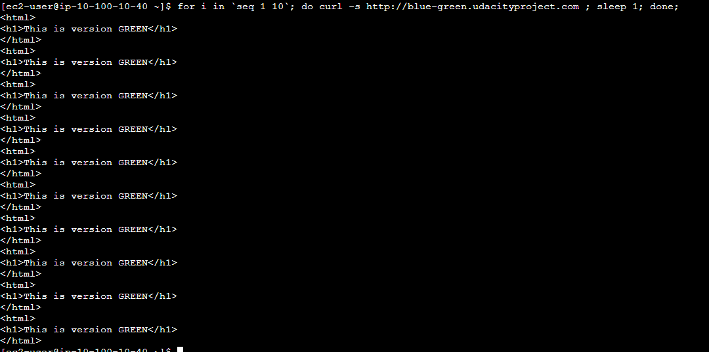

# Blue green

1. Create green deployment manifests for deploy and config file. Deploy them using blue-green.sh . Script waits for all(3) green deployments to be up

2. Create service for green deployment in teraform code. Create dns record for green deployment with same weight as in blue env. 50/50 split. 

3. Curl the record from curl-instance machine. 

4. Destroy blue environment 

5. reduce the weight of blue env to 0

6. Call the blue-green.udacityproject.com endpoint 