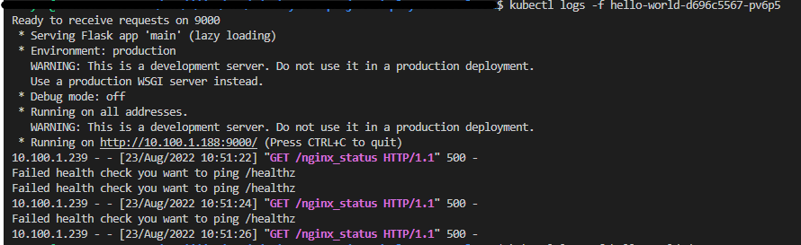
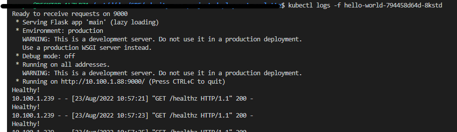

# Hello world

1. Hello world was crashing. 

    $ kubectl get pods

    hello-world-d696c5567-pv6p5   0/1     CrashLoopBackOff   6          7m21s

2. Checked logs for hello world service. Had this message displayed 

3. Replaced /nginx_status to /healthz in livenessProbe for hello world and redeployed

4. Logs displayed 

