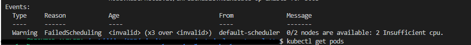
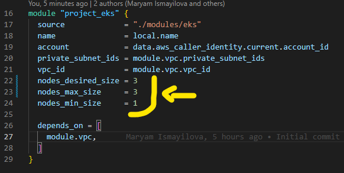

# Bloaty mcface

1. Not all pods were deployed, some are stuck in Pending state.

     

2. Since not enough resources were available, we could either scale up or horizontally. Scaling up would require recreation of nodes, that is why i decided to increase node count by one more cheap machine.

    